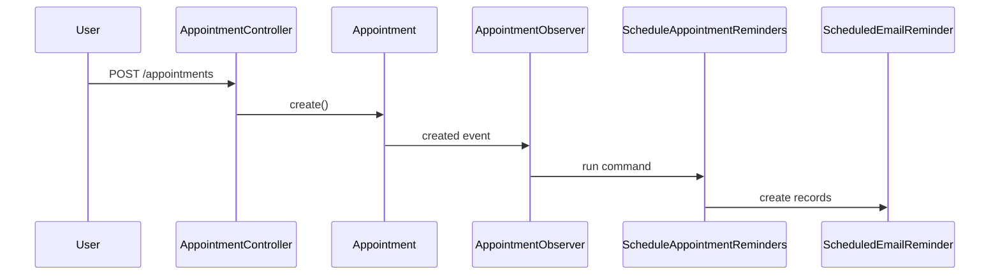
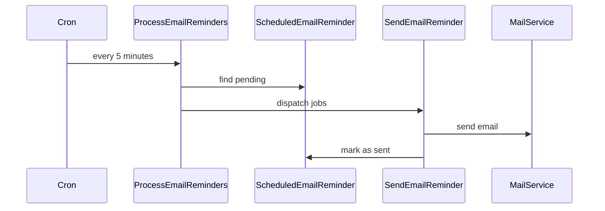
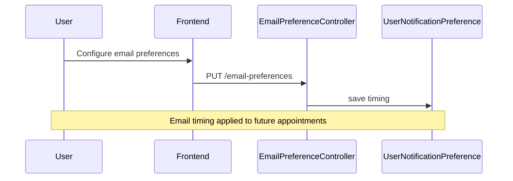

# Analyse : Système de Notifications de Rendez-vous (Email uniquement - Phase 1)

## 📋 User Story
**En tant que commercial**
Je veux être notifié par email avant mes rendez-vous
Afin de ne pas les oublier et m'y préparer

### Critères d'acceptation - Phase 1 (Email seulement)
- [ ] Une notification email est envoyée 1 heure avant le rendez-vous (configurable)
- [ ] La notification contient : Client, Contact, Heure, Lieu, Lien vers la fiche client
- [ ] L'utilisateur peut configurer ses préférences de délai (15min, 1h, 1j avant)
- [ ] Un rappel supplémentaire peut être configuré (ex: 1 jour avant)
- [ ] Les emails sont stylisés et professionnels

### Critères d'acceptation - Phase 2 (Futures)
- [ ] Notifications navigateur
- [ ] Notifications push mobile

---

## 🔍 Analyse de l'Infrastructure Existante

### ✅ Ce qui existe déjà

#### 1. **Système d'Appointments complet**
- **Modèle** : `app/Models/Appointment.php`
- **Contrôleur** : `app/Http/Controllers/Api/V1/AppointmentController.php`
- **Migration** : `database/migrations/2026_01_20_071738_create_appointments_table.php`

**Champs pertinents existants :**
```php
- scheduled_at (datetime)
- reminder_minutes (default: 15)
- reminder_sent_at (nullable) - déjà prévu !
- client_id, user_id, organizer_id
- title, description, location
- meeting_url
- type, status
- timezone
```

#### 2. **Système de Participants**
- **Modèle** : `app/Models/AppointmentParticipant.php`
- **Table** : `appointment_participants`
- Gestion des contacts internes et externes

#### 3. **Infrastructure Laravel existante**
- **Mail** : Configuration SMTP présente (`config/mail.php`)
- **Queue** : Configuration des jobs (`config/queue.php`)
- **Events** : `app/Providers/EventServiceProvider.php`

### ❌ Ce qui manque

#### 1. **Système de Notifications**
- Pas de table `notifications`
- Pas de modèles Notification
- Pas de jobs pour l'envoi automatique
- Pas de middleware pour notifications navigateur

#### 2. **Préférences Utilisateur pour Email**
- Pas de table `user_notification_preferences`
- Pas de configuration des délais de rappel personnalisés

#### 3. **Système Email et Jobs**
- Pas de jobs planifiés pour les rappels email
- Pas de Command pour traiter les notifications en attente
- Pas de templates email pour les rendez-vous

---

## 🏗️ Architecture Proposée (Email uniquement)

### 1. **Nouvelles Tables**

#### `user_notification_preferences` (Simplifiée pour email)
```php
Schema::create('user_notification_preferences', function (Blueprint $table) {
    $table->id();
    $table->foreignId('user_id')->constrained()->onDelete('cascade');
    $table->string('type'); // appointment_reminder
    $table->json('timing'); // [60, 1440] minutes avant
    $table->boolean('email_enabled')->default(true);
    $table->boolean('is_active')->default(true);
    $table->timestamps();

    $table->unique(['user_id', 'type']);
});
```

#### `scheduled_email_reminders`
```php
Schema::create('scheduled_email_reminders', function (Blueprint $table) {
    $table->id();
    $table->foreignId('appointment_id')->constrained()->onDelete('cascade');
    $table->foreignId('user_id')->constrained()->onDelete('cascade');
    $table->string('type'); // reminder_1h, reminder_1d
    $table->timestamp('scheduled_for');
    $table->timestamp('sent_at')->nullable();
    $table->string('status')->default('pending'); // pending, sent, failed
    $table->string('email_to');
    $table->text('failure_reason')->nullable();
    $table->timestamps();

    $table->index(['scheduled_for', 'status']);
    $table->index(['appointment_id', 'user_id']);
});
```

### 2. **Nouveaux Modèles**

#### `app/Models/UserNotificationPreference.php`
```php
class UserNotificationPreference extends Model
{
    protected $fillable = [
        'user_id', 'type', 'timing', 'email_enabled', 'is_active'
    ];

    protected $casts = [
        'timing' => 'array',
        'email_enabled' => 'boolean',
        'is_active' => 'boolean'
    ];

    public function user() { return $this->belongsTo(User::class); }

    public static function getDefaultTiming(): array
    {
        return [60]; // 1 heure par défaut
    }
}
```

#### `app/Models/ScheduledEmailReminder.php`
```php
class ScheduledEmailReminder extends Model
{
    protected $fillable = [
        'appointment_id', 'user_id', 'type', 'scheduled_for',
        'sent_at', 'status', 'email_to', 'failure_reason'
    ];

    protected $casts = [
        'scheduled_for' => 'datetime',
        'sent_at' => 'datetime'
    ];

    public function appointment() { return $this->belongsTo(Appointment::class); }
    public function user() { return $this->belongsTo(User::class); }

    public function markAsSent(): void
    {
        $this->update(['status' => 'sent', 'sent_at' => now()]);
    }

    public function markAsFailed(string $reason): void
    {
        $this->update(['status' => 'failed', 'failure_reason' => $reason]);
    }
}
```

### 3. **Jobs et Emails**

#### `app/Jobs/SendAppointmentEmailReminder.php`
```php
class SendAppointmentEmailReminder implements ShouldQueue
{
    use Dispatchable, InteractsWithQueue, Queueable, SerializesModels;

    public function __construct(
        public ScheduledEmailReminder $scheduledReminder
    ) {}

    public function handle()
    {
        try {
            $appointment = $this->scheduledReminder->appointment()
                ->with(['client', 'participants.contact'])
                ->first();

            if (!$appointment) {
                $this->scheduledReminder->markAsFailed('Appointment not found');
                return;
            }

            $user = $this->scheduledReminder->user;

            // Envoyer l'email de rappel
            Mail::to($user->email)->send(
                new AppointmentReminderMail($appointment, $this->scheduledReminder->type)
            );

            $this->scheduledReminder->markAsSent();

        } catch (\Exception $e) {
            $this->scheduledReminder->markAsFailed($e->getMessage());
            throw $e; // Re-throw pour retry automatique
        }
    }

    public function failed(\Exception $exception)
    {
        $this->scheduledReminder->markAsFailed($exception->getMessage());
    }
}
```

#### `app/Mail/AppointmentReminderMail.php`
```php
class AppointmentReminderMail extends Mailable
{
    use Queueable, SerializesModels;

    public function __construct(
        public Appointment $appointment,
        public string $reminderType
    ) {}

    public function build()
    {
        $timeUntil = $this->appointment->scheduled_at->diffForHumans();
        $subject = match($this->reminderType) {
            'reminder_1d' => "Rappel : Rendez-vous demain avec {$this->appointment->client->name}",
            'reminder_1h' => "Rappel : Rendez-vous dans 1 heure avec {$this->appointment->client->name}",
            default => "Rappel de rendez-vous"
        };

        return $this->markdown('emails.appointment-reminder')
                    ->subject($subject)
                    ->with([
                        'appointment' => $this->appointment,
                        'client' => $this->appointment->client,
                        'timeUntil' => $timeUntil,
                        'clientUrl' => url("/api/v1/clients/{$this->appointment->client_id}"),
                        'participants' => $this->appointment->participants
                    ]);
    }
}
```

### 4. **Commands Artisan**

#### `app/Console/Commands/ProcessAppointmentEmailReminders.php`
```php
class ProcessAppointmentEmailReminders extends Command
{
    protected $signature = 'appointments:process-email-reminders';
    protected $description = 'Process pending appointment email reminders';

    public function handle()
    {
        $pendingReminders = ScheduledEmailReminder::where('status', 'pending')
            ->where('scheduled_for', '<=', now())
            ->with(['appointment.client', 'user'])
            ->get();

        $this->info("Found {$pendingReminders->count()} pending email reminders");

        foreach ($pendingReminders as $reminder) {
            try {
                SendAppointmentEmailReminder::dispatch($reminder);
                $this->line("Dispatched reminder for appointment #{$reminder->appointment_id}");
            } catch (\Exception $e) {
                $this->error("Failed to dispatch reminder {$reminder->id}: {$e->getMessage()}");
            }
        }

        $this->info("Processed all pending email reminders");
    }
}
```

#### `app/Console/Commands/ScheduleAppointmentReminders.php`
```php
class ScheduleAppointmentReminders extends Command
{
    protected $signature = 'appointments:schedule-reminders {--days=7}';
    protected $description = 'Schedule email reminders for upcoming appointments';

    public function handle()
    {
        $days = (int) $this->option('days');

        $appointments = Appointment::with('user')
            ->where('scheduled_at', '>', now())
            ->where('scheduled_at', '<=', now()->addDays($days))
            ->whereNotIn('status', ['cancelled', 'completed'])
            ->get();

        $scheduled = 0;

        foreach ($appointments as $appointment) {
            $preferences = UserNotificationPreference::where('user_id', $appointment->user_id)
                ->where('type', 'appointment_reminder')
                ->where('email_enabled', true)
                ->where('is_active', true)
                ->first();

            $timings = $preferences?->timing ?? UserNotificationPreference::getDefaultTiming();

            foreach ($timings as $minutes) {
                $scheduledFor = $appointment->scheduled_at->subMinutes($minutes);

                if ($scheduledFor <= now()) continue; // Skip past times

                // Éviter les doublons
                $exists = ScheduledEmailReminder::where('appointment_id', $appointment->id)
                    ->where('user_id', $appointment->user_id)
                    ->where('type', "reminder_{$minutes}m")
                    ->exists();

                if (!$exists) {
                    ScheduledEmailReminder::create([
                        'appointment_id' => $appointment->id,
                        'user_id' => $appointment->user_id,
                        'type' => "reminder_{$minutes}m",
                        'scheduled_for' => $scheduledFor,
                        'email_to' => $appointment->user->email,
                        'status' => 'pending'
                    ]);
                    $scheduled++;
                }
            }
        }

        $this->info("Scheduled {$scheduled} email reminders");
    }
}
```

### 5. **Nouveaux Endpoints API (Email seulement)**

#### `app/Http/Controllers/Api/V1/EmailNotificationPreferenceController.php`
```php
// GET /api/v1/users/{user}/email-preferences
// PUT /api/v1/users/{user}/email-preferences
```

#### Extensions à `AppointmentController`
```php
// POST /api/v1/appointments/{appointment}/schedule-email-reminders
// GET /api/v1/email-reminders/pending
// GET /api/v1/email-reminders/sent
```

#### `resources/views/emails/appointment-reminder.blade.php`
```php
@component('mail::message')
# Rappel de rendez-vous

Bonjour {{ $appointment->user->first_name ?? $appointment->user->name }},

Vous avez un rendez-vous prévu **{{ $timeUntil }}** avec :

**{{ $client->name }}**

## Détails du rendez-vous

- **Date et heure :** {{ $appointment->scheduled_at->format('d/m/Y à H:i') }}
- **Lieu :** {{ $appointment->location ?? 'Non spécifié' }}
- **Type :** {{ ucfirst($appointment->type) }}
- **Durée :** {{ $appointment->duration }} minutes

@if($appointment->description)
**Description :**
{{ $appointment->description }}
@endif

@if($participants->count() > 0)
**Participants :**
@foreach($participants as $participant)
- {{ $participant->name }}{{ $participant->email ? " ({$participant->email})" : '' }}
@endforeach
@endif

@component('mail::button', ['url' => $clientUrl])
Voir la fiche client
@endcomponent

@component('mail::panel')
💡 **Conseil :** Préparez vos documents et questions à l'avance pour un rendez-vous productif.
@endcomponent

Bonne réunion !

L'équipe TargetDesk
@endcomponent
```

---

## 🔄 Workflow de Notification (Email uniquement)

### 1. **Création d'Appointment**


### 2. **Traitement des Rappels Email**


### 3. **Configuration Email Utilisateur**


---

## 📊 Plan d'Implémentation (Email uniquement - Phase 1)

### Phase 1: Infrastructure Email (2 jours)
1. **Créer les migrations des nouvelles tables**
   - `user_notification_preferences` (simplifiée pour email)
   - `scheduled_email_reminders`

2. **Créer les modèles associés**
   - `UserNotificationPreference` (focus email)
   - `ScheduledEmailReminder`

3. **Configurer l'email Laravel**
   - Vérifier config SMTP dans `config/mail.php`
   - Trait `Notifiable` sur User (si pas déjà présent)

### Phase 2: Jobs et Email Templates (1-2 jours)
4. **Créer les Jobs email**
   - `SendAppointmentEmailReminder`
   - Gestion des erreurs et retry

5. **Créer les Mailables**
   - `AppointmentReminderMail`
   - Template email responsive avec Markdown

6. **Templates email**
   - `emails/appointment-reminder.blade.php`
   - Stylisation professionnelle

### Phase 3: Commands et Scheduling (1 jour)
7. **Commands Artisan**
   - `ProcessAppointmentEmailReminders`
   - `ScheduleAppointmentReminders`
   - Ajout au scheduler Laravel (cron)

### Phase 4: API et Observer (1 jour)
8. **Observer pour Appointments**
   - Auto-scheduling des rappels à la création
   - Gestion des modifications/annulations

9. **Nouveaux endpoints email**
   - Gestion préférences email utilisateur
   - Historique des rappels envoyés

### Phase 5: Tests et Validation (1 jour)
10. **Tests**
    - Tests unitaires pour les jobs
    - Tests d'intégration pour les commands
    - Tests API pour les préférences

**Total estimé : 5-6 jours** (au lieu de 6-10 jours pour la version complète)

---

## 🎯 Critères d'Acceptation - Mapping (Email Phase 1)

| Critère | Solution Technique | Status |
|---------|-------------------|---------|
| ✅ Email 1h avant (configurable) | `timing` array dans `UserNotificationPreference` | À implémenter |
| ✅ Contenu riche (client, contact, heure, lieu, lien) | Template `AppointmentReminderMail` avec Blade | À implémenter |
| ✅ Préférences utilisateur configurables | Table `user_notification_preferences` (email focus) | À implémenter |
| ✅ Rappels multiples (1j avant) | Multiple records dans `ScheduledEmailReminder` | À implémenter |
| ✅ Emails stylisés et professionnels | Template Markdown avec Laravel Mail | À implémenter |

### Critères Future (Phase 2)
| Critère | Solution Technique | Status |
|---------|-------------------|---------|
| 🔮 Notifications navigateur | WebSocket + Service Worker | Phase 2 |
| 🔮 Notifications push mobile | FCM/APNs integration | Phase 2 |

---

## 🚀 Points d'Attention (Email Phase 1)

### Technique
- **Performance** : Indexer `scheduled_for` dans `scheduled_email_reminders`
- **Reliability** : Jobs avec retry automatique pour les échecs SMTP
- **Timezone** : Gérer les fuseaux horaires dans `scheduled_for`
- **Rate Limiting** : Éviter le spam email (max 1 rappel par type)

### Email
- **SMTP Configuration** : Vérifier la config email en production
- **Templates** : Responsive design pour mobile et desktop
- **Deliverability** : Tests anti-spam, authentification DKIM/SPF
- **Fallback** : Gestion des bounces et adresses invalides

### UX
- **Préférences simples** : Interface intuitive pour timing (15min, 1h, 1j)
- **Opt-out** : Possibilité de désactiver les rappels
- **Preview** : Prévisualisation des emails avant envoi

### Sécurité
- **Permissions** : Seul l'organisateur reçoit les rappels
- **Privacy** : Pas d'infos sensibles dans l'objet email
- **Validation** : Vérifier la validité des adresses email

---

## 📈 Métriques de Succès (Email Phase 1)

- **Taux de délivrance** : % d'emails envoyés avec succès
- **Taux d'ouverture** : % d'emails ouverts (tracking pixels)
- **Taux de clic** : % de clics sur le lien "Voir client"
- **Réduction des no-shows** : Comparaison avant/après
- **Réactivité** : Délai entre programmation et envoi

---

**Status : 🟢 Analyse ajustée - Focus Email uniquement**
**Effort estimé : 5-6 jours de développement** (réduit de ~40%)
**Complexité : Moyenne-Faible - Architecture email simplifiée et éprouvée**

---

## 🔄 Migration vers Phase 2

Une fois la Phase 1 (Email) validée, la Phase 2 pourra ajouter :
- **Notifications navigateur** (WebSocket + Service Worker)
- **Push mobile** (FCM/APNs)
- **Table unifiée** `notifications` pour tous les canaux
- **Interface temps réel** pour les notifications

L'architecture actuelle est conçue pour évoluer facilement vers ces fonctionnalités.